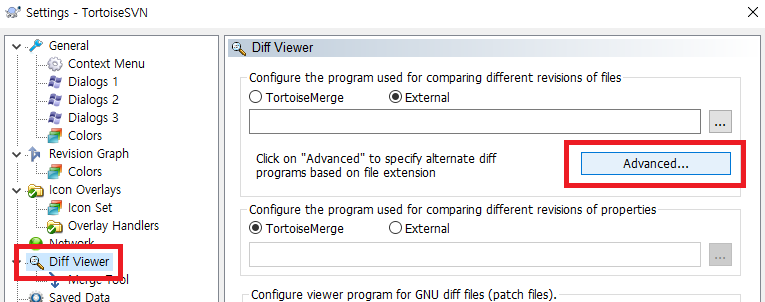
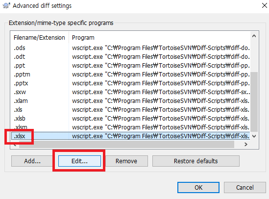
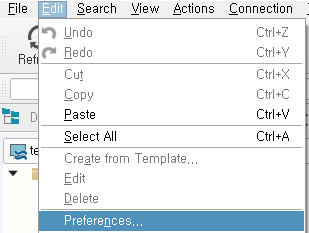
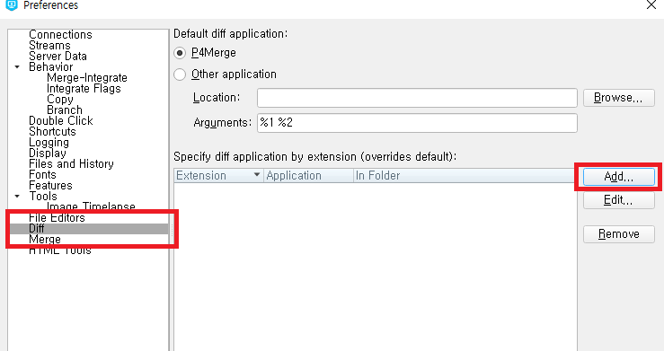
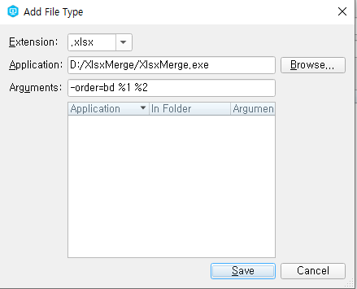
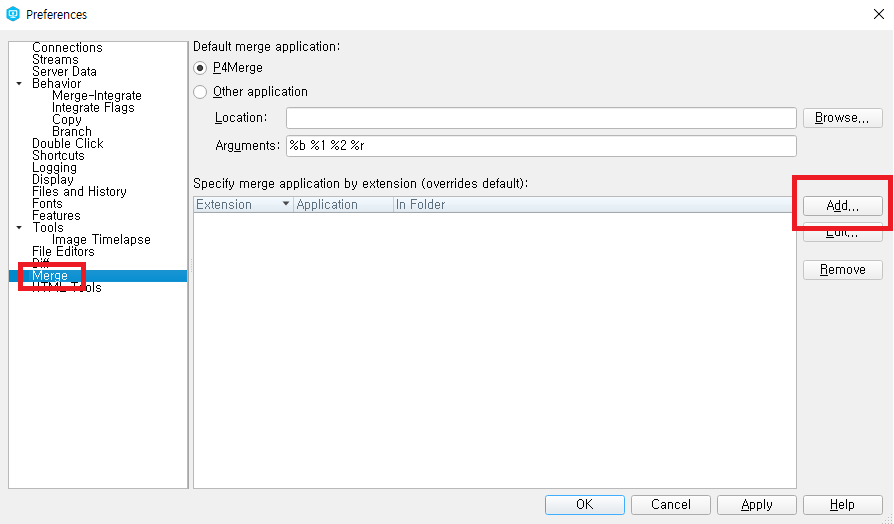
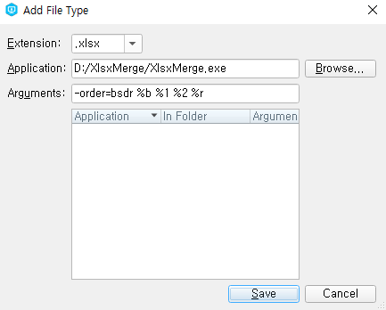
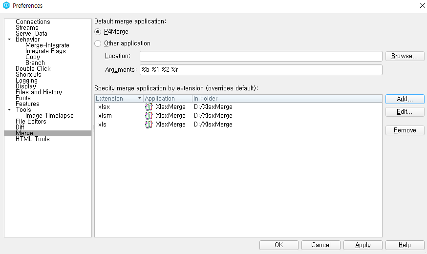

XlsxMerge는 커맨드 라인 옵션을 통해 여러 SCM 와의 연동을 지원합니다. svn, git, perforce, plasticscm 등에 대한 연동 문서가 있으며, 직접 연동을 하는 방법도 안내합니다.

- [TortoiseSVN / TortoiseGit](#tortoisesvn--tortoisegit)
- [Perforce](#perforce)
- [PlasitcSCM](#plasticscm-pscm)
- [그 외의 도구 : 직접 연동하기](#그-외의-도구--직접-연동하기)

# TortoiseSVN / TortoiseGit

Note : Git 의 경우 사용하는 클라이언트에 따라 파일 확장자별 diff / merge 도구를 지정 가능한 지 여부가 달라집니다.

TortoiseGit의 경우 TortoiseSVN 과 유사한 방식으로 설정이 가능합니다.

## 주의 : TortoiseSVN에서 Merge / Edit Conflict 시 주의하세요!

TortoiseSVN 는 Edit Conflict 시 비교 대상 파일과 머지 결과 파일을 같은 경로로 지정합니다.

즉, Edit Conflict 결과를 저장한 후에, 바로 Resolve하지 않고 다시 Edit Conflict를 하면,

초기 충돌 당시 상태가 아닌, **수정된 데이터를 바탕으로 비교가 진행**이 되어 이상 동작을 할 수 있습니다.

## Diff 설정

탐색기에서 아무 곳에나 우클릭 후 TortoiseSVN > Settings 메뉴를 선택해 설정 메뉴를 엽니다.

Diff Viewer 항목에서 Advanced.. 를 누릅니다.

`.xlsx` 확장자를 찾아, Edit로 편집합니다

External Program 항목에 다음과 같이 입력합니다.

- `<XlsxMerge.exe 경로> -order=bd %base %mine`
- 예 : `D:\XlsxMerge\XlsxMerge.exe -order=bd %base %mine`

이후 .xls, .xlsm 등에 동일한 진행을 해 줍니다.

## Merge

앞서의 Diff Tool 과 같은 방식으로 진행합니다.

설정 메뉴 왼쪽의 Diff Viewer - Merge Tool 항목에서 Advanced.. 를 누릅니다.

`.xlsx` 확장자를 찾아, Edit로 편집합니다

- `<XlsxMerge.exe 경로> -order=rsdb %merged %theirs %mine %base`
- 예 : `D:\XlsxMerge\XlsxMerge.exe -order=rsdb %merged %theirs %mine %base`

이후 .xls, .xlsm 등에 동일한 진행을 해 줍니다.

# Perforce

## 설정하기

Perforce Client (P4V) 에서는 `Edit` > `Preferences` 메뉴를 통해, 엑셀 파일의 diff / merge 도구를 지정할 수 있습니다.

## Diff 도구 추가

위 그림과 같이 Diff 를 누르고, 확장자 별 diff 도구에서 추가 (Add) 를 누릅니다.

이어 나오는 세부 입력 창에서 다음과 같이 입력합니다.

- Extension : `.xlsx`
- Application : XlsxMerge 경로
- Arguments : `-order=bd %1 %2`

위 추가 작업을 `.xls`, `.xlsm` 파일에 동일하게 진행해 주세요.
이후 나온 결과를 확인하고, OK 를 눌러 설정을 마칩니다.

## Merge

Merge 방법은 앞서와 비슷합니다.

위 그림과 같이 Merge 를 누르고, 확장자 별 merge 도구에서 추가 (Add) 를 누릅니다.

- Extension : `.xlsx`
- Application : XlsxMerge 경로
- Arguments : `-order=bsdr %b %1 %2 %r`

위 추가 작업을 `.xls`, `.xlsm` 파일에 동일하게 진행해 주세요.
이후 나온 결과를 확인하고, OK 를 눌러 설정을 마칩니다.

# PlasticSCM (PSCM)

## Diff Tools 추가

- PlasticSCM 을 실행하고, 왼쪽의 Preferences를 누릅니다.

- Diff Tools 탭을 선택 후 Add를 누릅니다.

- 다음과 같이 값을 입력하고 OK 를 눌러 추가합니다.

  - `External Diff tool` 선택 
  - 경로는 다음과 같이 입력
    - `"[설치경로]\XlsxMerge.exe" -b="@sourcefile" -d="@destinationfile"`
    - 예 : `"D:\XlsxMerge\XlsxMerge.exe" -b="@sourcefile" -d="@destinationfile"`
  - `Use with files that match the following pattern` 체크 
  - 패턴을 다음과 같이 입력 `*.xls*`

- 추가된 항목의 우선순위를 맨 위로 올립니다.
(선택 후 UP 버튼을 눌러 우선순위 조정)

## Merge Tools 추가

- PlasticSCM 을 실행하고, 왼쪽의 Preferences를 누릅니다.

- Merge Tools 탭을 선택 후 Add를 누릅니다.

- 다음과 같이 값을 입력하고 OK 를 눌러 추가합니다.

  - `External Diff tool` 선택 
  - 경로는 다음과 같이 입력
    - `"[설치경로]\XlsxMerge.exe" -b="@basefile" -d="@destinationfile" -s="@sourcefile" -r="@output"`
    - 예 : `"D:\XlsxMerge\XlsxMerge.exe" -b="@basefile" -d="@destinationfile" -s="@sourcefile" -r="@output"`
  - `Use with files that match the following pattern` 체크 
  - 패턴을 다음과 같이 입력 `*.xls*`

- 추가된 항목의 우선순위를 맨 위로 올립니다.
(선택 후 UP 버튼을 눌러 우선순위 조정)

# 그 외의 도구 : 직접 연동하기

기본 가이드에 없거나, 맞지 않는 경우 직접 연동을 설정해볼 수 있습니다.

## 커맨드라인 구조
XlsxMerge는 다음 두 가지 형태의 커맨드 라인을 지원합니다.

### -b / -d / -s / -r 스위치
다음 스위치를 이용하여 diff / merge 에 필요한 parameter 구성이 가능합니다.
- `-b` : Base 파일 경로.
- `-d` : Mine (Destination, Current) 파일 경로.
- `-s` : Theirs (Source, Others) 파일 경로. merge 에서만 사용합니다.
- `-r` : Merge 결과를 저장할 파일 경로. merge 에서만 사용하며, 생략 가능합니다.

호출 예제
- `"D:\XlsxMerge\XlsxMerge.exe" -b="D:\Base.xlsx" -d="D:\Mine.xlsx"`
- `"D:\XlsxMerge\XlsxMerge.exe" -b="D:\Base.xlsx" -d="D:\Mine.xlsx" -s="D:\Theirs.xlsx"`
- `"D:\XlsxMerge\XlsxMerge.exe" -b="D:\Base.xlsx" -d="D:\Mine.xlsx" -s="@D:\Theirs.xlsx" -r="D:\MergeResult.xlsx"`

### 경로 나열
일부 SCM Client (예 : Perforce P4V) 의 경우 스위치 형태의 입력을 제대로 지원하지 않습니다.

이러한 경우에는 `-order` 스위치를 사용하고 이후에 경로를 순서대로 나열하는 방식으로 지정이 가능합니다.

`order` 스위치는 `-order=bdsr` 의 형태로 입력하며, 이 스위치에서 입력한 b/s/d/r 순서에 따라 경로를 입력해 줍니다. b/d/s/r 의 의미는 위에서 설명한 -b/-d/-s/-r 스위치를 참조하세요.

호출 예제 
- `"D:\XlsxMerge\XlsxMerge.exe" -order=bd "D:\Base.xlsx" "D:\Mine.xlsx"`
- `"D:\XlsxMerge\XlsxMerge.exe" -order=bds "D:\Base.xlsx" "D:\Mine.xlsx" "D:\Theirs.xlsx"`
- `"D:\XlsxMerge\XlsxMerge.exe" -order=bdsr "D:\Base.xlsx" "D:\Mine.xlsx" "D:\Theirs.xlsx" "D:\MergeResult.xlsx"`
